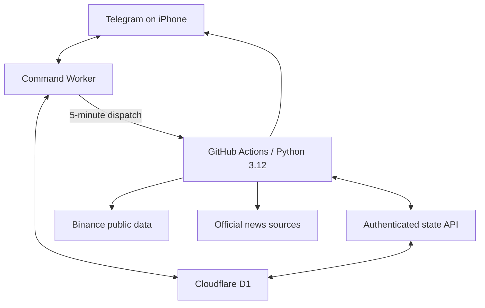

# Architecture

## Outcome

BTC Sentinel uses a hybrid free architecture because no single free service
meets all of these needs at once: Python compute, durable relational state,
instant Telegram commands, frequent scheduling, and phone-friendly operation.

## Components

### Python engine

The Python 3.12 engine owns deterministic calculations:

- market-data validation;
- completed-candle indicators and structure;
- timeframe hierarchy and regime classification;
- news risk filtering;
- signal construction;
- entry, target, stop, expiry, and cancellation reconstruction;
- fixed and managed virtual tracks;
- statistics, reports, and backtests.

Production analysis runs as short GitHub Actions jobs. A job never trusts local
runner files as state. It reads the last committed checkpoint from the state
API, processes only unprocessed closed candles, and commits one idempotent
batch.

### Command Worker

The small Cloudflare Worker is not the analysis engine. It has five narrow
responsibilities:

1. validate Telegram webhook requests;
2. reject every unauthorized Telegram user;
3. serve immediate read-only commands and controlled pause/resume changes;
4. dispatch the Python workflow from a five-minute Cron Trigger;
5. expose a signed, typed state API used by the Python engine.

It uses a D1 binding, so no database credential is placed in application code.

### Durable state

Cloudflare D1 stores signals, original terms, trade tracks, immutable events,
management decisions, outcomes, statistics snapshots, news records,
checkpoints, configuration, health runs, and the alert outbox.

The schema uses SQLite semantics and is also exercised locally with `sqlite3`.
Application code uses optimistic versions, unique deduplication keys, and
transactions. Original terms and audit rows cannot be updated or deleted.

### Telegram delivery

Telegram is an external network boundary. The durable outbox prevents ordinary
duplicate scheduling, but Telegram `sendMessage` does not offer a general
idempotency key. A process crash after Telegram accepts a message but before D1
records the returned message ID creates an unavoidable uncertain-delivery
case. Such a row is marked `UNKNOWN`; it is not blindly replayed.

This is honest at-most-one-retry behavior, not a false “exactly once” claim.

## Scheduling model

- A Cloudflare Cron Trigger dispatches the engine workflow every five minutes
  once Phase 12 is enabled. This avoids relying on GitHub's repository-inactivity
  behavior for native scheduled workflows.
- Setup decisions use completed candles only.
- New 15-minute setups are evaluated after a 15-minute candle closes.
- An active paper trade is reconstructed from every closed one-minute candle
  since the durable checkpoint.
- Daily, weekly, and monthly reports are selected by Casablanca local time,
  while schedules and stored timestamps remain UTC.

The dispatch does not guarantee that a GitHub runner starts immediately or that
every external API remains available. The replay model recovers accounting
after a delayed or missed job. It cannot provide a guaranteed real-time exit
and is unsuitable for automatic execution.

## Free-tier fit

The expected database volume is tiny because raw candle history is not copied
into D1. D1 holds decisions, events, checkpoints, and compact snapshots. The
Worker performs lightweight command/database work only. Heavy scans and
backtests stay in Python jobs.

A public GitHub repository can use standard hosted Actions without metered
minutes. A private repository has an included-minute quota and cannot sustain a
five-minute schedule indefinitely for free. The strategy code can be public;
all credentials remain encrypted secrets.

Free-service terms and limits can change. Deployment documentation must recheck
official limits before activation.

## Failure behavior

The safe default is silence plus a durable health error:

- stale required market data: no signal;
- missing timeframe: no signal;
- contradictory core sources: no signal;
- database unavailable: do not calculate from guessed state;
- Telegram unavailable: retain a bounded outbox row;
- missed schedule: replay from checkpoint;
- ambiguous TP/SL order after one-minute reconstruction: conservative outcome;
- duplicated job: unique run and event keys turn it into a no-op.

Only a serious, actionable failure creates an owner alert.
