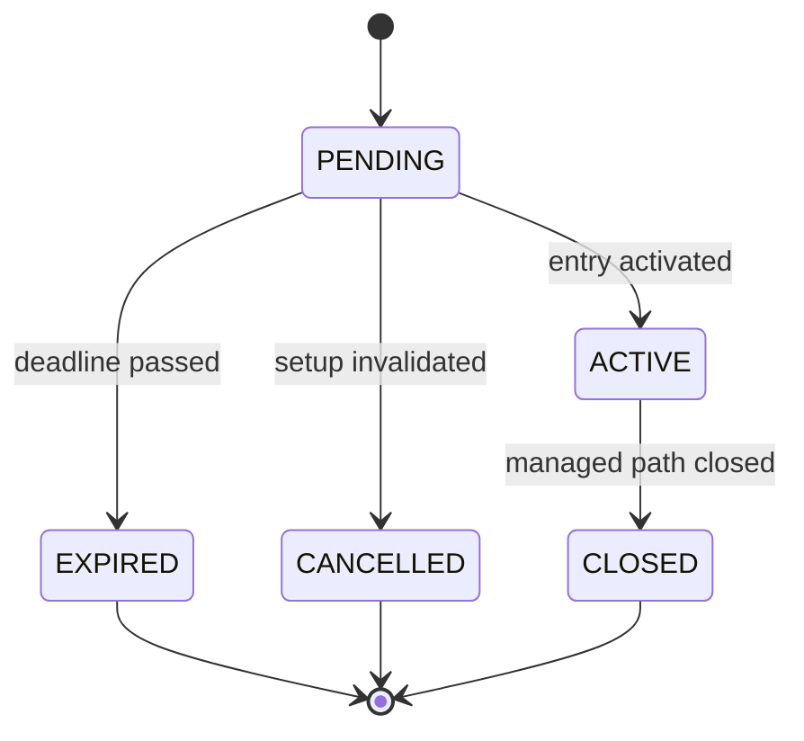

# Persistence model

## Why an event ledger

Mutable “current state” rows make commands fast. Immutable event rows preserve
what actually happened. Both are needed:

- `signals` answers “what is the current lifecycle state?”
- `trade_events` answers “how and when did it get there?”
- `trade_tracks` holds the current `FIXED` and `MANAGED` virtual paths.
- `outcomes` stores final track results once, without rewriting history.

## Core records

| Record | Purpose | Mutation rule |
| --- | --- | --- |
| `signals` | Original setup and lifecycle | Original terms immutable; status versioned |
| `signal_targets` | TP1–TP3 and planned R | Immutable |
| `trades` | Activation/fill snapshot | Immutable |
| `trade_tracks` | Fixed and managed live paths | Optimistic updates allowed |
| `trade_events` | Every lifecycle/target/close event | Append-only |
| `management_decisions` | Data-known-at-the-time decision | Append-only |
| `outcomes` | Final result per track | Insert once |
| `statistics_snapshots` | Stats immediately after closures | Append-only |
| `news_events` | Deduplicated news evidence | Classification may be versioned |
| `processing_checkpoints` | Last fully processed source/candle | Monotonic update |
| `outbox` | Telegram delivery coordination | Controlled state machine |
| `telegram_updates` | Durable update claims and retry leases | Identity immutable; status controlled |
| `command_audit` | Owner command and delivery result | Append-only |
| `bot_settings` | Non-secret operational settings | Versioned update |
| `health_runs` | Job health and stale-data evidence | Append-only |
| `state_api_nonces` | Short-lived HMAC replay prevention | Insert once; expired cleanup |
| `workflow_dispatches` | Cron-to-Action dispatch identity and result | Identity immutable |

## Price representation

Prices and R values are serialized as canonical decimal strings. Binary floats
are not accepted in the domain model. This avoids quietly changing the original
entry, stop, or target because of floating-point representation.

## Lifecycle

Target hits and close reasons are events attached to the relevant track; they
are not extra lifecycle states.

Phase 7 reconstructs these transitions from contiguous completed Spot
one-minute candles. Its signal-specific checkpoint stores the last fully
processed candle open time. Activation time is durable, so replay after a crash
cannot reinterpret the activation candle as a later target hit. Same-candle
target/stop ambiguity is recorded explicitly and resolved stop-first.

Phase 8 records each managed-track decision in the append-only
`management_decisions` ledger. A state-changing decision updates only the
managed track's current stop, remaining fraction, and accumulated realized R.
The fixed track is never updated by management. Each decision has a stable
per-candle strategy key; its checkpoint advances separately so a crash cannot
apply a different decision to the same candle.

Phase 9 inserts a `statistics_snapshots` row inside the same transaction that
closes a track. If outcome semantics or snapshot persistence fails, the track
close rolls back too. Every snapshot is a complete recalculation over immutable
outcomes, identifies the triggering track, and keeps unresolved fixed/managed
pairs explicit. Snapshots cannot be updated or deleted.

## Idempotency

- Each signal ID is unique.
- Each event has a stable unique `dedupe_key`.
- Each alert has a stable unique `dedupe_key`.
- Each Telegram `update_id` is claimed through a time-bounded processing lease.
- Each handled command has at most one immutable audit row.
- Each outcome is unique by `(signal_id, variant)`.
- Each signal has at most one immutable trade activation.
- A partial unique index allows at most one managed `ACTIVE` BTC signal.
- Jobs and checkpoints use semantic keys rather than runner-local files.
- State API nonces and scheduled dispatch instants are claimed atomically.
