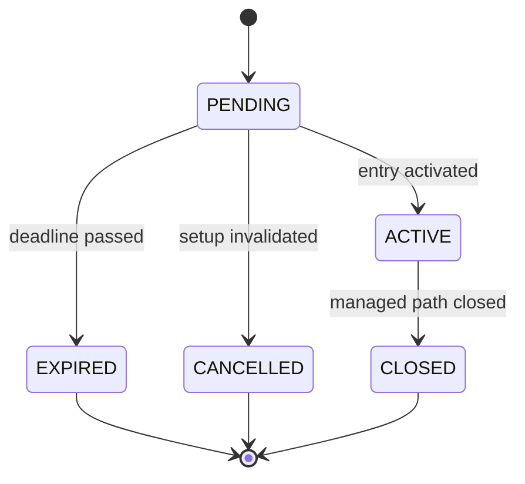

# Persistence model

## Why an event ledger

Mutable “current state” rows make commands fast. Immutable event rows preserve
what actually happened. Both are needed:

- `signals` answers “what is the current lifecycle state?”
- `trade_events` answers “how and when did it get there?”
- `trade_tracks` holds the current `FIXED` and `MANAGED` virtual paths.
- `outcomes` stores final track results once, without rewriting history.

## Core records

| Record | Purpose | Mutation rule |
| --- | --- | --- |
| `signals` | Original setup and lifecycle | Original terms immutable; status versioned |
| `signal_targets` | TP1–TP3 and planned R | Immutable |
| `trades` | Activation/fill snapshot | Immutable |
| `trade_tracks` | Fixed and managed live paths | Optimistic updates allowed |
| `trade_events` | Every lifecycle/target/close event | Append-only |
| `management_decisions` | Data-known-at-the-time decision | Append-only |
| `outcomes` | Final result per track | Insert once |
| `statistics_snapshots` | Stats immediately after closures | Append-only |
| `news_events` | Deduplicated news evidence | Classification may be versioned |
| `processing_checkpoints` | Last fully processed source/candle | Monotonic update |
| `outbox` | Telegram delivery coordination | Controlled state machine |
| `bot_settings` | Non-secret operational settings | Versioned update |
| `health_runs` | Job health and stale-data evidence | Append-only |

## Price representation

Prices and R values are serialized as canonical decimal strings. Binary floats
are not accepted in the domain model. This avoids quietly changing the original
entry, stop, or target because of floating-point representation.

## Lifecycle

Target hits and close reasons are events attached to the relevant track; they
are not extra lifecycle states.

## Idempotency

- Each signal ID is unique.
- Each event has a stable unique `dedupe_key`.
- Each alert has a stable unique `dedupe_key`.
- Each outcome is unique by `(signal_id, variant)`.
- Each signal has at most one immutable trade activation.
- A partial unique index allows at most one managed `ACTIVE` BTC signal.
- Jobs and checkpoints use semantic keys rather than runner-local files.

